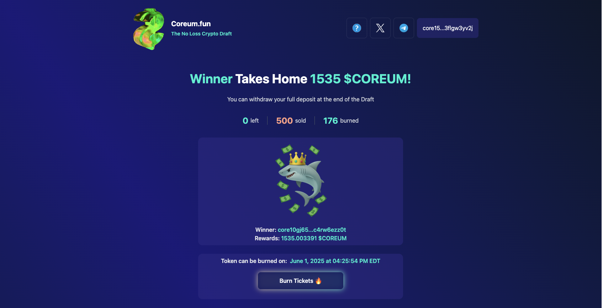
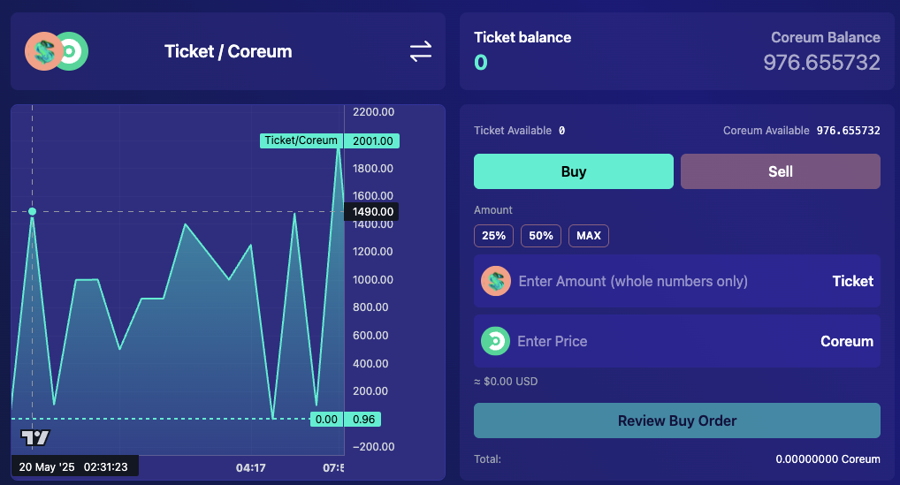
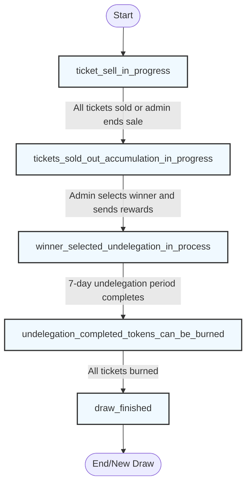
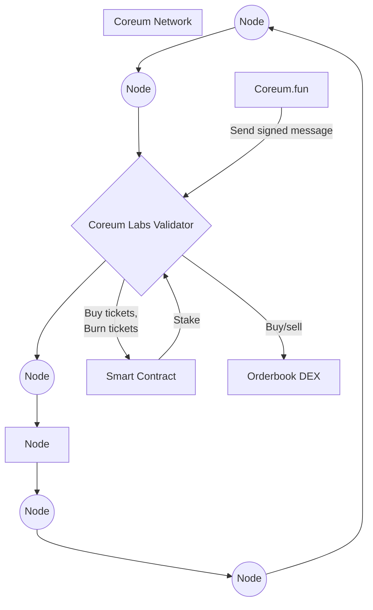
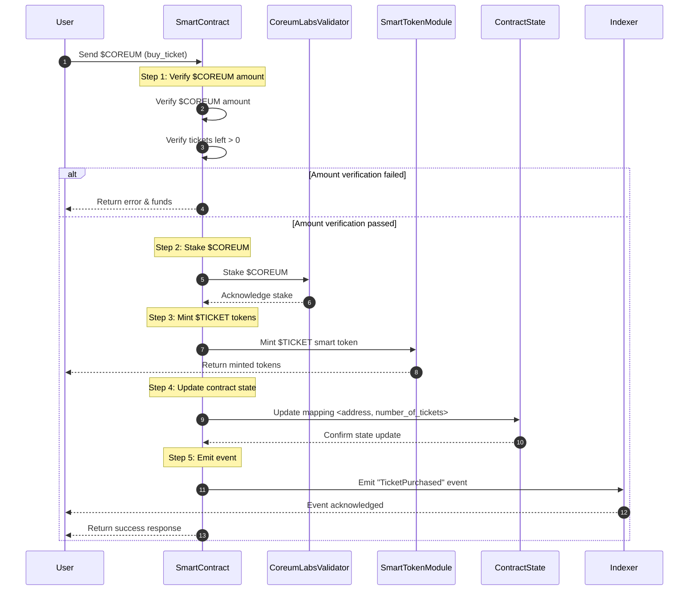
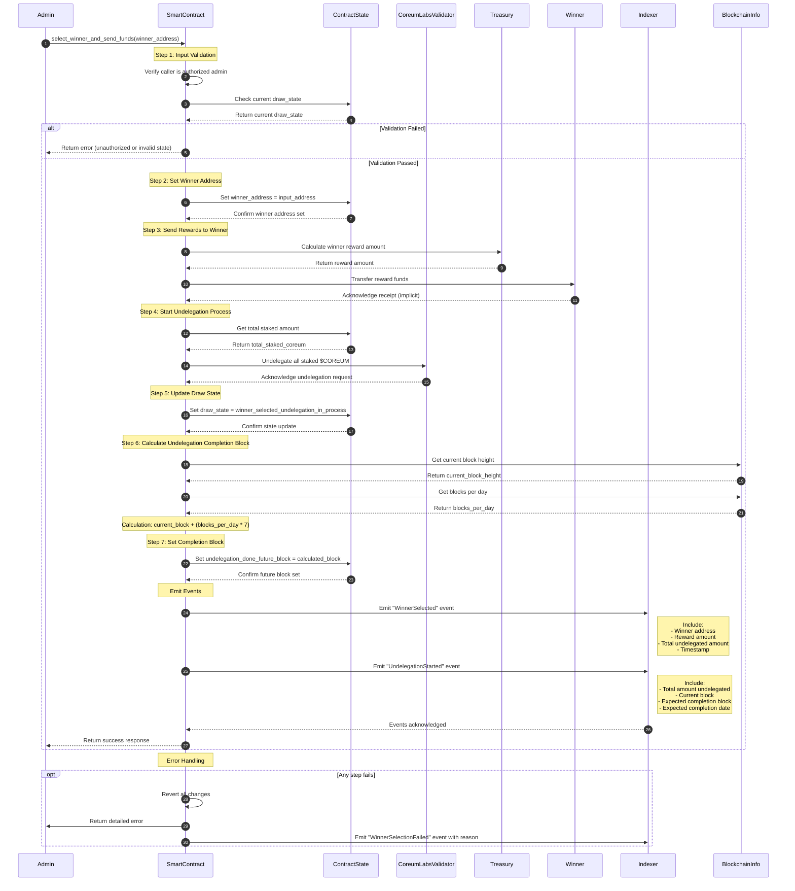
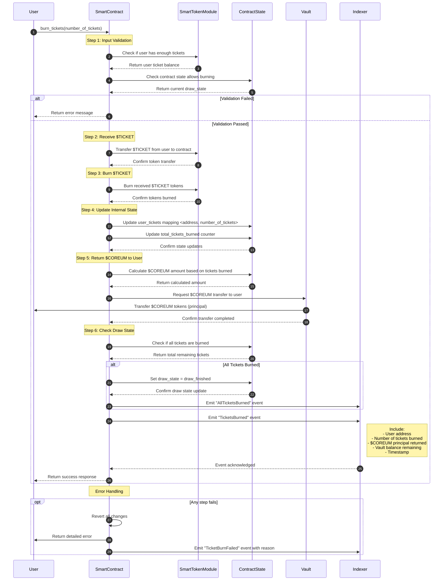

# Coreum.fun: The No Loss Draft

[](https://coreum.fun)
[](https://x.com/Coreum_dot_fun)
[](https://x.com/helwan_mande/status/1924473913179824265)
[](https://medium.com/@coreumlabs/introducing-coreum-fun-ac28118771a9)

This repository contains the code for the Coreum.fun website and Smart Contract - a simple and easy-to-understand implementation of a No Loss Draft on Coreum, leveraging the Coreum Orderbook DEX and Smart Tokens.

## 📋 Overview



### 🎯 Why We Built This

- Create a simple implementation leveraging Coreum Orderbook DEX (released in v5)
- Build a fun and engaging community application
- Increase exposure to the [Coreum Labs](https://coreum.com/labs) [validator node](https://validator.info/coreum/corevaloper14e0slqpzhgsakm6fwnh5sk6mu2dmdc9ghxhuw5)

### 🎲 What is a No Loss Draft?

A No Loss Draft is a system where user does not lose their principal if they don't win:

- Participants buy tickets at a fixed price
- All participants get their tokens back at the end of the draw
- The yield generated is used to pay winners

### ⚙️ How It Works

1. **Ticket Purchase**

   - Each ticket is a Smart Token
   - Fixed price: 200 COREUM per ticket
   - Limited supply: 500 tickets total

2. **Token Management**

   - COREUM is staked to Coreum Labs validator node
   - Tickets represent claims on the token pool
   - Yield from staking is used for payouts

3. **Trading**

   - Tickets can be traded on Coreum Orderbook DEX
   - Secondary market allows price discovery
   - Tickets can be burned to reclaim COREUM at the end of the draw

4. **Draw Process**
   - Countdown starts when all tickets are sold
   - Random number generation selects winner
   - Participants can burn tickets to reclaim COREUM

## 🔍 Key Concepts

### No Loss Draft

- Inspired by PoolTogether (2017, Ethereum)
- Participants get their tokens back after the draw
- Yield generated through validator staking
- More efficient implementation on Coreum's PoS network

### $TICKET

$TICKET is a smart token that represents ownership of a ticket in the No Loss Draft.
It can be traded on the Coreum Orderbook DEX and has the following properties:

- Minting: to mint token as they are bought by the draft participant
- Burning: to burned to tokens when the principal is returned

Learn more about Smart Tokens in the [Coreum documentation](https://docs.coreum.dev/docs/next/modules/coreum-fungible-token)

### Coreum Orderbook DEX

A permissionless Orderbook built at the protocol level of Coreum blockchain.
[Learn more about Coreum Orderbook DEX](https://github.com/CoreumFoundation/coreum/tree/master/x/dex/spec)

#### Order Attributes

Users can place orders with the following attributes:

- `order_id` - unique order identifier of the order.
- `base_denom` - when you buy, you are buying the `base_denom`, when you sell, you are selling the `base_denom`.
- `quote_denom` - when you buy, you are selling the `quote_denom`, when you sell, you are buying the `quote_denom`.
- `price` - value of one unit of the `base_denom` expressed in terms of the `quote_denom`. It indicates how much of the
  `quote_denom` is needed to buy one unit of the `base_denom`.
- `quantity` - is amount of the `base_denom` being traded.
- `side`
  - `sell` - means that the order is to sell `base_denom` `quantity` with the `price`.
  - `buy` - means that the order is to buy `base_denom` `quantity` with the `price`.
- `time_in_force` - how long an order will remain active before it is executed or expires, based on matching state.
  - `GTC` - Good Til Canceled
  - `IOC` - Immediate Or Cancel
  - `FOK` - Fill or Kill
- `good_til` - how long an order will remain active before it is executed or expires, based height or time.
  - `good_til_block_height` - max block height to execute the order, or it will be canceled.
  - `good_til_block_time` - max block time to execute the order, or it will be canceled.



#### DEX Parameters

In this section we will explain the parameters of the DEX that are relevant to the No Loss Draft. More information about the DEX can be found in the [Coreum Orderbook DEX documentation](https://github.com/CoreumFoundation/coreum/tree/master/x/dex/spec)

- price_tick_size ensures that prices have a fixed minimum increment, preventing arbitrary fractional values.
- quantity_step enforces a minimum step size for base asset quantities, ensuring consistent calculations.
- quote_quantity_step provides a consistent step size for quote amounts, derived from the other two parameters.

See more here: https://docs.coreum.dev/docs/next/modules/coreum-dex/prices-and-limits

- default_unified_ref_amount: 0.000000000000000001
- price_tick_exponent: 18
- quantity_step_exponent: 1
- max_orders_per_denom: 6
- order_reserve: denom: utestcore, amount: 10000000

##### Implication for the $TICKET token

To simplify the maths $TICKET will have the same precision as COREUM (6) to avoid precision loss and to make it easier to trade with. This will be enforced by the smart contract. 
On the UI we will make sure that the user can only buy or sell full tickets.

On the other a ticket is only redeemable for $COREUMs it's a full $TICKET (meaning 1 *10^6 uticket`)

### Trading Pairs Explained

#### Base Token

- The token being bought/sold
- Quantity shown on the left side of orderbook
- Example: "100 TICKET" means trading 100 TICKET

#### Quote Token

- The token used for pricing
- Price shown on the right side of orderbook
- Example: "1.5 COREUM" means price is 1.5 COREUM per TICKET

#### Example: TICKET/COREUM Pair

- Buy TICKET → Pay in COREUM
- Sell TICKET → Receive COREUM
- Price expressed in COREUM per TICKET


## Draft lifecycle

This diagram is a detailed view of the lifecycle of a draft on Coreum.fun governed by the smart contract.



## Architecture

### Context Diagram

This diagram is a high-level overview of the Coreum.fun application. We wanted to show the relationship between the Coreum.fun application, the Coreum Labs validator node, and the Coreum Orderbook DEX.



### Contract

#### Sequence Diagram (Buy Ticket)

The `buy_ticket` function allows users to purchase one or many tickets. This function handles:

1. Verify the $COREUM amount sent
2. Verify that some tickets are left
3. If this was the last ticket set draw_state=tickets_sold_out_accumulation_in_progress
4. Stake the $COREUM to Coreum Labs validator
5. Mint and send the $TICKET smart token to the user
6. Update the contract internal state (map <address, number_of_ticket)
7. Emit an event that will be picked up by the indexer



#### Sequence Diagram (Select Winner and Send Funds)

The `select_winner_and_send_funds` function receives the winner's address and sends them the funds. It also handles starting the undelegation process for all the tokens:

1. Receive the winner address
2. Set the winner address
3. Send the rewards to the address
4. Start the undelegation process for all the tokens the contract has
5. Set draw_state=winner_selected_undelegation_in_process
6. Calculate the block at which the undelegation will be completed
7. Set undelegation_done_future_block




#### Sequence Diagram (Burn Ticket)

The `burn_tickets` function allows users to burn their tickets to get their principal back:

1. Receive the $TICKET
2. Burn the $TICKET
3. Update internal state (<address, number_of_ticket)
4. If all the tickets have been burned, set draw_state=draw_finished
5. Send back the $COREUM to the user



## 🚀 Getting Started

### As a user

- Go to the [Coreum.fun website](https://coreum.fun)
- Buy tickets with $COREUM
- Cross fingers and hope to win
- Wait for the draw to finish
- If you won, the your rewards will be sent to your wallet!
- If you didn't win, you can burn your tickets to get your principal 7 days after the draw

### As a developer

#### Frontend Development

```bash
# Clone the repository
git clone [repository-url]

# Install dependencies
npm install

# Start development server
npm run dev

# Access the application
# Open http://localhost:3000 in your browser
```

#### Smart Contract Development

To work with the smart contract, you can use the provided shell scripts in this repository:

- **Optimize the Contract:**
  - Run `./optimize.sh` to optimize your smart contract before deployment.

- **Instantiate the Contract:**
  - Run `./instantiate.sh` to deploy and instantiate your contract on the blockchain.

- **Interact with the Contract:**
  - Use the following scripts for contract actions:
    - `./buy_ticket.sh` – Buy tickets in the draft.
    - `./burn_ticket.sh` – Burn tickets to reclaim your principal.
    - `./add_bonus_reward.sh` – Add bonus rewards to the contract.
    - `./select_winner_and_delegate.sh` – Select a winner and delegate rewards.
    - `./send_funds.sh` and `./send_funds_to_winner.sh` – Send funds as needed.
    - `./update_state.sh` – Update the contract state.
    - `./migrate_contract.sh` – Migrate the contract if needed.

> **Tip:** Each script is designed for a specific contract action. Open the script files to review any required arguments or environment variables before running them.

---

**The smart contract source code can be found here:**
[@https://github.com/Coreum-Labs/coreum_fun-contract/](https://github.com/Coreum-Labs/coreum_fun-contract/)

## 📄 License

This project is licensed under the GNU General Public License v3.0.
