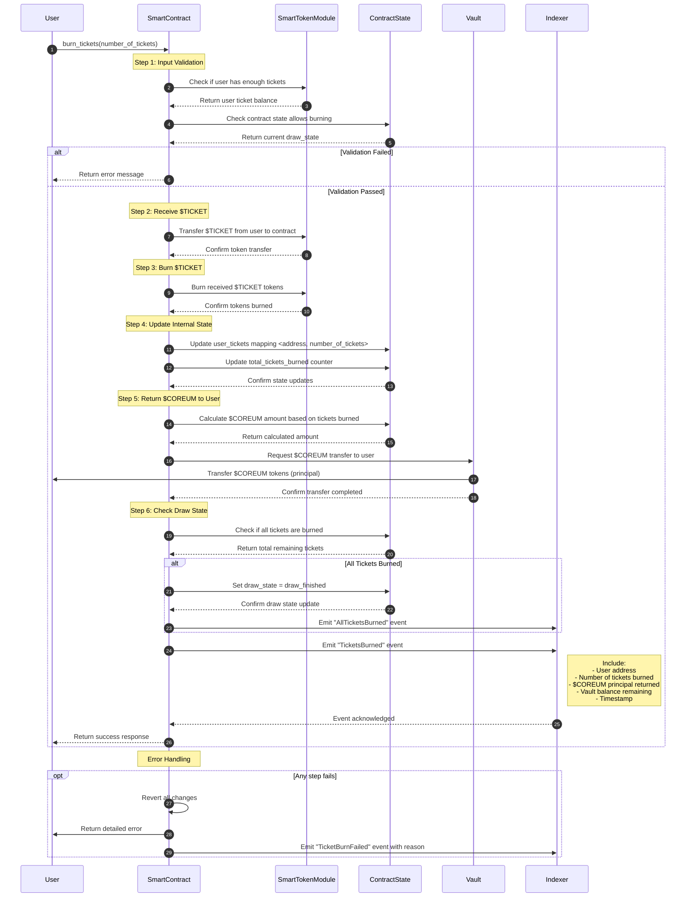

```mermaid
sequenceDiagram
    autonumber
    participant User
    participant SmartContract
    participant SmartTokenModule
    participant ContractState
    participant Vault
    participant Indexer

    User->>SmartContract: burn_tickets(number_of_tickets)

    Note over SmartContract: Step 1: Input Validation
    SmartContract->>SmartTokenModule: Check if user has enough tickets
    SmartTokenModule-->>SmartContract: Return user ticket balance
    SmartContract->>ContractState: Check contract state allows burning
    ContractState-->>SmartContract: Return current draw_state

    alt Validation Failed
        SmartContract-->>User: Return error message
    else Validation Passed
        Note over SmartContract: Step 2: Receive $TICKET
        SmartContract->>SmartTokenModule: Transfer $TICKET from user to contract
        SmartTokenModule-->>SmartContract: Confirm token transfer

        Note over SmartContract: Step 3: Burn $TICKET
        SmartContract->>SmartTokenModule: Burn received $TICKET tokens
        SmartTokenModule-->>SmartContract: Confirm tokens burned

        Note over SmartContract: Step 4: Update Internal State
        SmartContract->>ContractState: Update user_tickets mapping <address, number_of_tickets>
        SmartContract->>ContractState: Update total_tickets_burned counter
        ContractState-->>SmartContract: Confirm state updates

        Note over SmartContract: Step 5: Return $COREUM to User
        SmartContract->>ContractState: Calculate $COREUM amount based on tickets burned
        ContractState-->>SmartContract: Return calculated amount
        SmartContract->>Vault: Request $COREUM transfer to user
        Vault->>User: Transfer $COREUM tokens (principal)
        Vault-->>SmartContract: Confirm transfer completed

        Note over SmartContract: Step 6: Check Draw State
        SmartContract->>ContractState: Check if all tickets are burned
        ContractState-->>SmartContract: Return total remaining tickets

        alt All Tickets Burned
            SmartContract->>ContractState: Set draw_state = draw_finished
            ContractState-->>SmartContract: Confirm draw state update
            SmartContract->>Indexer: Emit "AllTicketsBurned" event
        end

        SmartContract->>Indexer: Emit "TicketsBurned" event
        Note right of Indexer: Include:<br/>- User address<br/>- Number of tickets burned<br/>- $COREUM principal returned<br/>- Vault balance remaining<br/>- Timestamp

        Indexer-->>SmartContract: Event acknowledged
        SmartContract-->>User: Return success response
    end

    Note over SmartContract: Error Handling
    opt Any step fails
        SmartContract->>SmartContract: Revert all changes
        SmartContract->>User: Return detailed error
        SmartContract->>Indexer: Emit "TicketBurnFailed" event with reason
    end
```
