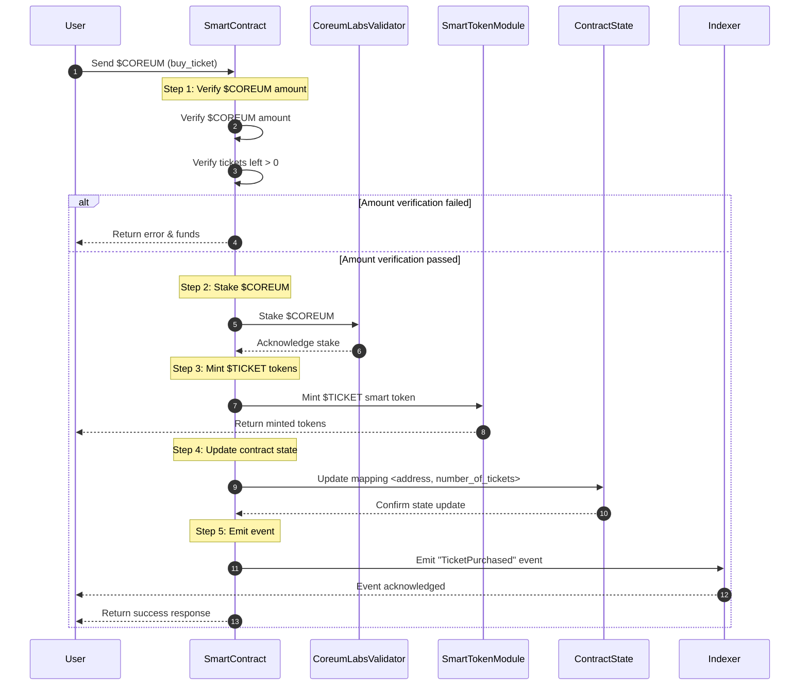

```mermaid
sequenceDiagram
    autonumber
    participant User
    participant SmartContract
    participant CoreumLabsValidator
    participant SmartTokenModule
    participant ContractState
    participant Indexer

    User->>SmartContract: Send $COREUM (buy_ticket)

    Note over SmartContract: Step 1: Verify $COREUM amount
    SmartContract->>SmartContract: Verify $COREUM amount
    SmartContract->>SmartContract: Verify tickets left > 0

    alt Amount verification failed
        SmartContract-->>User: Return error & funds
    else Amount verification passed
        Note over SmartContract: Step 2: Stake $COREUM
        SmartContract->>CoreumLabsValidator: Stake $COREUM
        CoreumLabsValidator-->>SmartContract: Acknowledge stake

        Note over SmartContract: Step 3: Mint $TICKET tokens
        SmartContract->>SmartTokenModule: Mint $TICKET smart token
        SmartTokenModule-->>User: Return minted tokens

        Note over SmartContract: Step 4: Update contract state
        SmartContract->>ContractState: Update mapping <address, number_of_tickets>
        ContractState-->>SmartContract: Confirm state update

        Note over SmartContract: Step 5: Emit event
        SmartContract->>Indexer: Emit "TicketPurchased" event
        Indexer-->>User: Event acknowledged

        SmartContract-->>User: Return success response
    end
```
