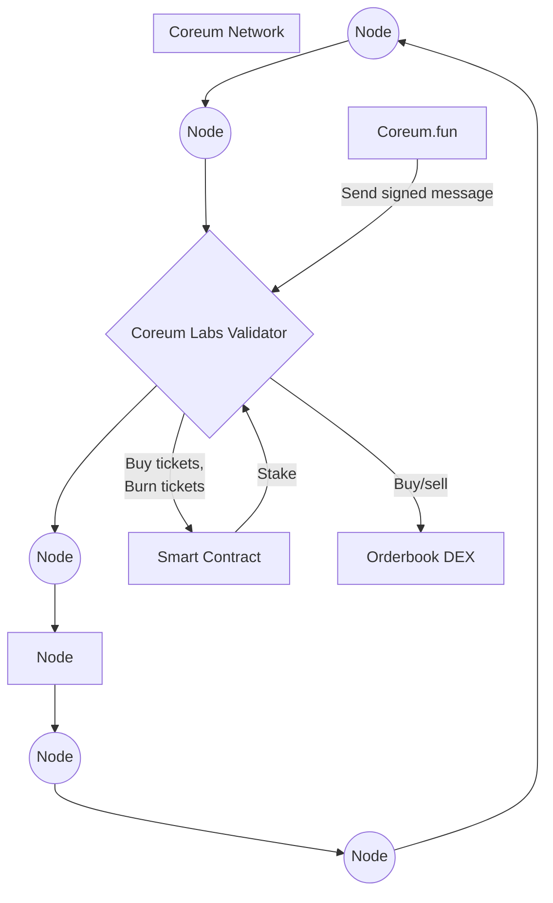

```mermaid
graph TD
    %% Network nodes
    TopNode((Node))
    LeftNode((Node))
    RightNode((Node))
    BottomRight((Node))
    BottomSquare[Node]
    Node63((Node))

    %% Main components
    Validator{Coreum Labs Validator}
    CoreumFun[Coreum.fun]
    SmartContract[Smart Contract]
    OrderbookDEX[Orderbook DEX]

    %% Network circular structure
    TopNode --> LeftNode
    LeftNode --> Validator
    Validator --> Node63
    Node63 --> BottomSquare
    BottomSquare --> BottomRight
    BottomRight --> RightNode
    RightNode --> TopNode

    %% Component connections
    CoreumFun -- "Send signed message" -->  Validator
    Validator -- "Buy tickets,<br/>Burn tickets" --> SmartContract
    SmartContract -- "Stake" --> Validator
    Validator -- "Buy/sell" --> OrderbookDEX

    %% Title
    subgraph Coreum Network
    end
```
