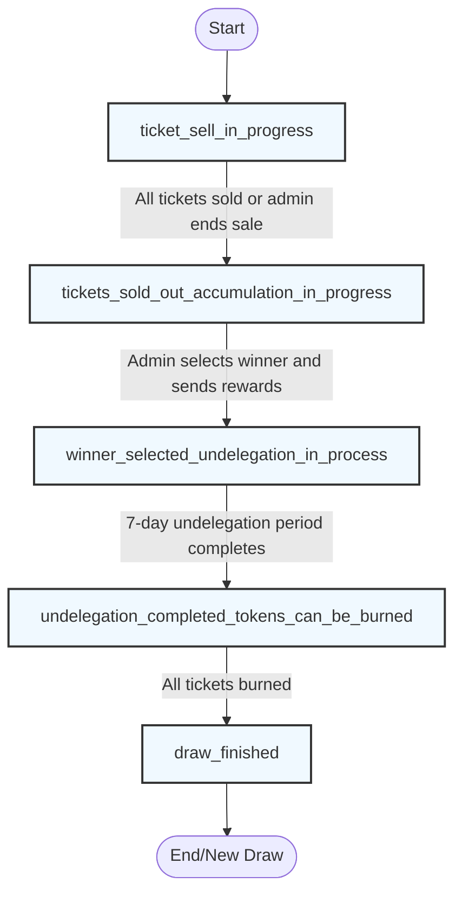

```mermaid
flowchart TD
    Start([Start]) --> State1

    State1[ticket_sell_in_progress]
    State1 --> |"All tickets sold or admin ends sale"| State2

    State2[tickets_sold_out_accumulation_in_progress]
    State2 --> |"Admin selects winner and sends rewards"| State3

    State3[winner_selected_undelegation_in_process]
    State3 --> |"7-day undelegation period completes"| State4

    State4[undelegation_completed_tokens_can_be_burned]
    State4 --> |"All tickets burned"| State5

    State5[draw_finished]
    State5 --> End([End/New Draw])

    classDef stateClass fill:#f0f9ff,stroke:#333,stroke-width:2px
    class State1,State2,State3,State4,State5 stateClass
```
