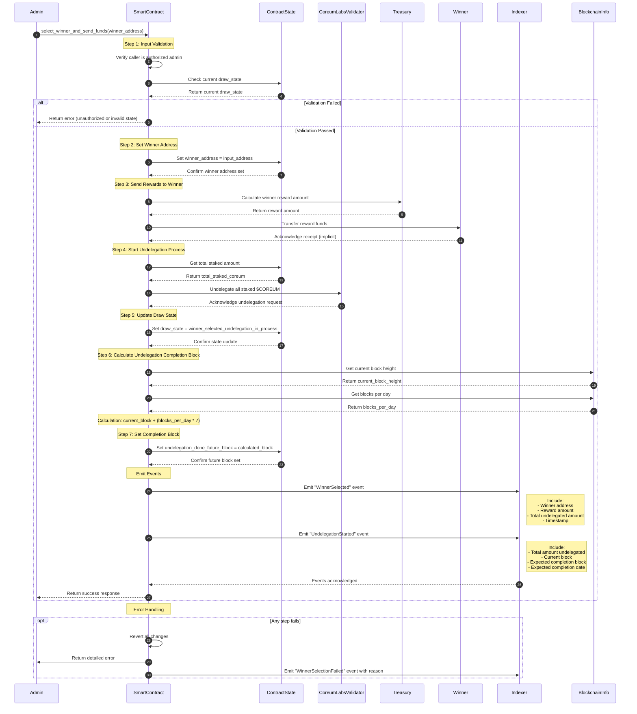

```mermaid
sequenceDiagram
    autonumber
    participant Admin
    participant SmartContract
    participant ContractState
    participant CoreumLabsValidator
    participant Treasury
    participant Winner
    participant Indexer
    participant BlockchainInfo

    Admin->>SmartContract: select_winner_and_send_funds(winner_address)

    Note over SmartContract: Step 1: Input Validation
    SmartContract->>SmartContract: Verify caller is authorized admin
    SmartContract->>ContractState: Check current draw_state
    ContractState-->>SmartContract: Return current draw_state

    alt Validation Failed
        SmartContract-->>Admin: Return error (unauthorized or invalid state)
    else Validation Passed
        Note over SmartContract: Step 2: Set Winner Address
        SmartContract->>ContractState: Set winner_address = input_address
        ContractState-->>SmartContract: Confirm winner address set

        Note over SmartContract: Step 3: Send Rewards to Winner
        SmartContract->>Treasury: Calculate winner reward amount
        Treasury-->>SmartContract: Return reward amount
        SmartContract->>Winner: Transfer reward funds
        Winner-->>SmartContract: Acknowledge receipt (implicit)

        Note over SmartContract: Step 4: Start Undelegation Process
        SmartContract->>ContractState: Get total staked amount
        ContractState-->>SmartContract: Return total_staked_coreum
        SmartContract->>CoreumLabsValidator: Undelegate all staked $COREUM
        CoreumLabsValidator-->>SmartContract: Acknowledge undelegation request

        Note over SmartContract: Step 5: Update Draw State
        SmartContract->>ContractState: Set draw_state = winner_selected_undelegation_in_process
        ContractState-->>SmartContract: Confirm state update

        Note over SmartContract: Step 6: Calculate Undelegation Completion Block
        SmartContract->>BlockchainInfo: Get current block height
        BlockchainInfo-->>SmartContract: Return current_block_height
        SmartContract->>BlockchainInfo: Get blocks per day
        BlockchainInfo-->>SmartContract: Return blocks_per_day

        Note over SmartContract: Calculation: current_block + (blocks_per_day * 7)

        Note over SmartContract: Step 7: Set Completion Block
        SmartContract->>ContractState: Set undelegation_done_future_block = calculated_block
        ContractState-->>SmartContract: Confirm future block set

        Note over SmartContract: Emit Events
        SmartContract->>Indexer: Emit "WinnerSelected" event
        Note right of Indexer: Include:<br/>- Winner address<br/>- Reward amount<br/>- Total undelegated amount<br/>- Timestamp

        SmartContract->>Indexer: Emit "UndelegationStarted" event
        Note right of Indexer: Include:<br/>- Total amount undelegated<br/>- Current block<br/>- Expected completion block<br/>- Expected completion date

        Indexer-->>SmartContract: Events acknowledged
        SmartContract-->>Admin: Return success response
    end

    Note over SmartContract: Error Handling
    opt Any step fails
        SmartContract->>SmartContract: Revert all changes
        SmartContract->>Admin: Return detailed error
        SmartContract->>Indexer: Emit "WinnerSelectionFailed" event with reason
    end
```
