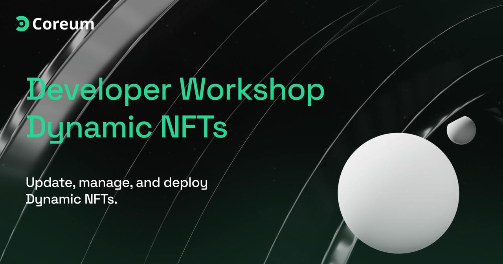

# Dynamic NFT Data Updater



## Overview

This FullStack-DynamicData project demonstrates how to update dynamic data within NFTs. It uses Go for the backend, handling blockchain transactions, Axios for fetching APIs, and React for the frontend, providing a user interface to interact with the NFTs.

This Cosmwas-FullStack project will learn about the basics of NFTs, their applications, and the technical implementation of updating NFT metadata dynamically using Cosmwasm for the the contracts, generated typescript for cosmwasm interaction,  and Next.js for the frontend. By the end of the workshop, attendees will have a functional understanding of how to create, mint, and update dynamic data in NFTs.

## Learning Objectives

By the end of this workshop, you will be able to:

- Understand the architecture of NFTs and their dynamic data capabilities.
- Set up a development environment with Go, Next and React.
- Build Http server and middleware in Golang
- Interact backend with your React Application
- Build Cosmwasm contracts, generate typescript for cosmwasm contracts
- Interact with the Coreum blockchain to create, mint, and update NFTs.

## Prerequisites

Before attending the workshop, please ensure you have the following:

- Basic understanding of the blockchain ecosystem.
- Experience with JavaScript, NextJs, React and TypeScript.
- Basic knowledge of Go programming language.
- Knowledge on Cosmwasm Contracts
- A code editor of your choice installed (e.g., VS Code).

## Setup

### Backend (Go)

1. **Install Go:** Ensure that you have Go installed. You can download it from [here](https://golang.org/dl/).

2. **Clone the Repository:**
   ```bash
   https://github.com/Jahanzeb9999/workshops.git   
   cd Coreum_V4_Update_DynamicData
