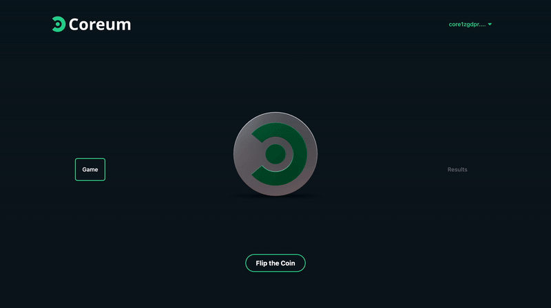
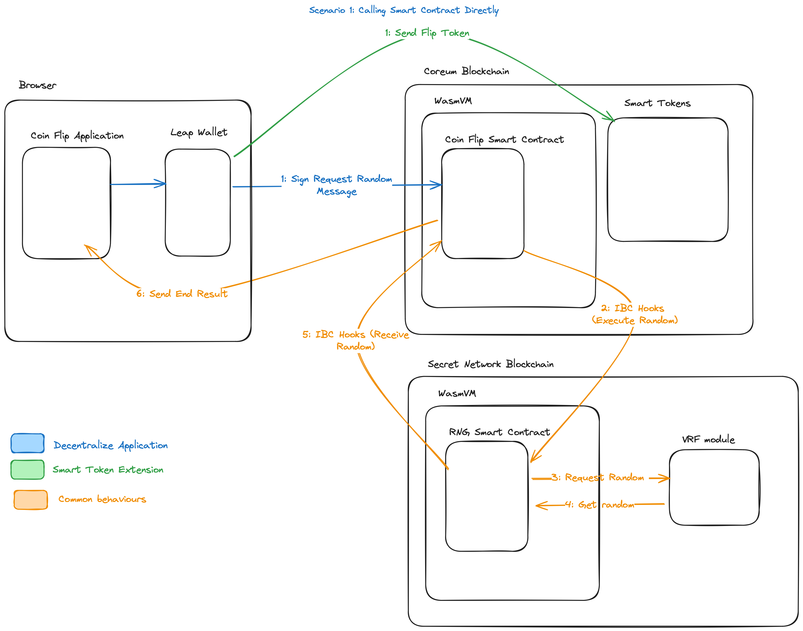

# Coreum v4 Update - IBC Hooks and Smart Tokens Extension



## Set up

### Frontend

This is a Next.js project. To get started, run the following commands:

```bash
npm install
npm run dev
```

The project will be available at [http://localhost:3000](http://localhost:3000).

The smart contract is hardcoded in the `src/pages/index.tsx` file. You can change the contract address interact with your own contract.

### Smart Contract

The smart contract we use in this workshop is already deployed on the Coreum blockchain. You can find the contract address in the `src/pages/index.tsx` file.

If you want to deploy your own contract, you can use the following command:

#### Compile

```bash
cd ibchooks-secretVFR/consumer-side
make build-mainnet-reproducible

```

#### Store

```bash
cd ibchooks-secretVFR/consumer-side/artifacts
./cored tx wasm store coreum_flip_the_coin.wasm --from [yourwallet] --gas auto --gas-adjustment 1.3  --chain-id coreum-mainnet-1 --node https://full-node.mainnet-1.coreum.dev:26657
```

##### Issue your Smart Token with the Extension

```bash
./cored tx assetft issue [symbol] [subunit] [precision] [initial_amount] [description] --uri --uri_hash --from [admin] --features=burning,freezing,minting,extension --burn-rate=0 --send-commission-rate=0 --extension_code_id=[codeID] --extension_label=my-extension --extension_funds=1000ucore --extension_issuance_msg='{}' --chain-id=coreum-mainnet-1 --node https://full-node.mainnet-1.coreum.dev:26657 --gas auto --gas-adjustment 1.3
```

You will find the smart contract address in the output of the command.

## Context Diagram

The context diagram below shows the interaction between the different components of the set up on a very high level.


