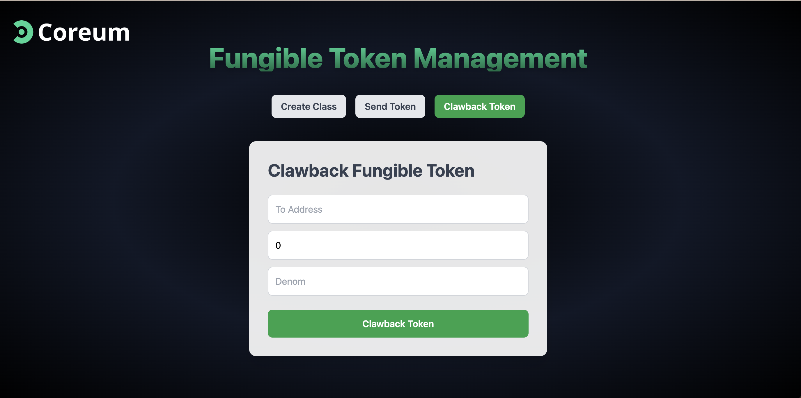

# tokenClawback



## Overview

This project demonstrates how to implement and manage the token clawback mechanism within fungible tokens. It uses Go for the backend, handling blockchain transactions and smart contract interactions, Axios for fetching APIs, and Next.js for the frontend, providing a user interface to interact with the tokens.

Participants will learn about the basics of fungible tokens, their applications, and the technical implementation of the token clawback mechanism using Go for the backend, Axios for backend API interactions, and React.js for the frontend. By the end of the workshop, attendees will have a functional understanding of how to create, send, and clawback tokens.

## Learning Objectives

By the end of this workshop, you will be able to:

- Understand the architecture of fungible tokens and the clawback mechanism.
- Set up a development environment with Go and React.
- Build an HTTP server and middleware in Go.
- Interact with the backend using your React application.
- Interact with the Coreum blockchain to create, send, and clawback tokens.

## Prerequisites

Before attending the workshop, please ensure you have the following:

- Basic understanding of the blockchain ecosystem.
- Experience with JavaScript and TypeScript.
- Familiarity with Node.js and npm package management.
- Basic knowledge of Go programming language.
- A code editor of your choice installed (e.g., VS Code).

## Setup

### Backend (Go)

1. **Install Go:** Ensure that you have Go installed. You can download it from [here](https://golang.org/dl/).

2. **Clone the Repository:**
   ```bash
   git clone https://github.com/Jahanzeb9999/tokenClawback.git
   cd tokenClawback/backend
   ```

3. **Run the Backend:**
   ```bash
   go run main.go
   ```

4. **Run the Frontend:**
   ```bash
   npm run start
   ```
