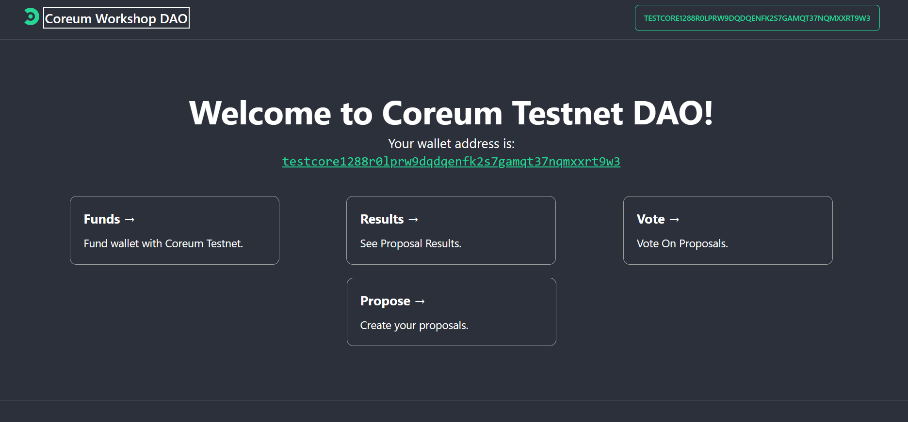

# Bootstrap WebApp Development Workshop on Coreum


This repository is the end product of the Bootstrap WebApp Development Workshop, where we will build a dao platform for proposing new workshops and then voting on those workshops on the Coreum blockchain.

Feel free to clone, edit and play with the code before, during and after the workshop.👨‍💻

## Workshop Overview

This workshop is designed to take you through the steps of creating a dao that interacts with the Coreum blockchain. Participants will gain hands-on experience with Create Coreum App, CosmoKit, CosmWasm and CosmJS. 

## DAO Platform Explanation 

This DAO allows people to propose a workshop and then have that workshop be voted on, using Coreum blockchain. Each vote has a 2 min lifespan before it is finalized. The results of that vote are then displayed. 

## Learning Objectives

By the end of this workshop, you will be able to:

- Understand the architecture of a DApp.
- Connect a DApp to the Coreum blockchain.
- Interact with CosmWasm contracts via a UI frontend.
- Understand how a DAO contract works on Coreum Blockchain
- Utilize CosmJS handle blockchain transactions.

## Pre-requisites

Before attending the workshop, please ensure you have the following:

- Basic understanding of the blockchain ecosystem.
- Experience with JavaScript and Typescript.
- Familiarity with Rust 
- Familiarity with node.js and npm package management.
- A code editor of your choice installed (e.g., VS Code).

## Setup

To get started with the workshop, clone this repository and install the dependencies:

```bash
git clone https://github.com/your-repo/bootstrap-webapp-development-workshop.git
cd bootstrap-webapp-development-workshop
npm install
npm run dev