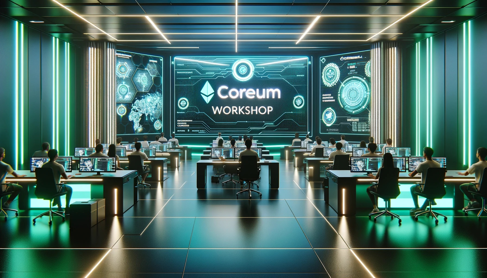

# Coreum Workshops

Welcome to the **Coreum Workshops** repository! This repository is your gateway to various hands-on workshops, each designed to enhance your skills in developing applications on the Coreum blockchain.

## Available Workshops

Below is a list of workshops available in this repository. Click on a workshop to access its materials, instructions, and additional resources.

### 1. [Bootstrap Web Development on Coreum](./Boostrap_WebApp_Development/)
In this comprehensive workshop, participants will dive into the world of decentralized application development using the Create Coreum App Npm package. This workshop is tailored for developers looking to streamline their web development process and integrate with the Coreum Blockchain seamlessly.

#### What You Will Learn
- Setting up a full-stack web development environment tailored for Coreum.
- Effective interaction and signing of Coreum custom messages using web-based wallets.
- Step-by-step guidance on creating a IBC transfer and denom construction.
- Hands-on experience with IBC  in the browser, including transfering FT token to other chains, denom construction

#### Prerequisites
- Basic knowledge of TypeScript and React.
- One of the following wallets installed: Keplr, Leap, Cosmostation, or Frontier.

_More workshops will be added as they become available._

## Workshop Recordings and Details

For detailed explanations and recordings of these workshops, visit the [Coreum Workshops](https://www.coreum.com/workshops) page on the Coreum website.

### 2. [IBC Web Development on Coreum](./IBCTransfer_WebApp_Development/)
In this comprehensive workshop, participants will dive into the world of decentralized application development using the Create Coreum App Npm package. This workshop is tailored for developers looking to streamline their web development process and integrate with the Coreum Blockchain seamlessly.

#### What You Will Learn
- Setting up a full-stack web development environment tailored for Coreum.
- Effective interaction and signing of Coreum custom messages using web-based wallets.
- Step-by-step guidance on creating a IBC transfer and denom construction.
- Hands-on experience with IBC  in the browser, including transfering FT token to other chains, denom construction

#### Prerequisites
- Basic knowledge of TypeScript and React.
- One of the following wallets installed: Keplr, Leap, Cosmostation, or Frontier.

_More workshops will be added as they become available._

## Workshop Recordings and Details

For detailed explanations and recordings of these workshops, visit the [Coreum Workshops](https://www.coreum.com/workshops) page on the Coreum website.

## Contributing

We welcome contributions! If you have suggestions or want to contribute to the workshop materials, please feel free to submit pull requests or raise issues.
