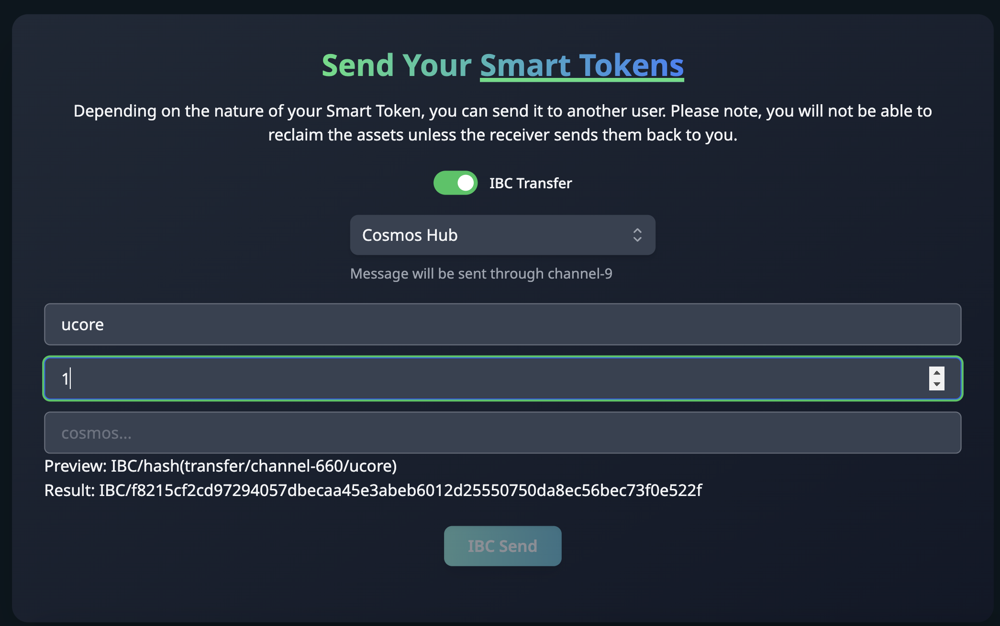

<<<<<<< HEAD
# IBC Workshops


Welcome to our workshop on Inter-Blockchain Communication (IBC) transfers, a revolutionary technology enabling secure and reliable data and value exchange between different blockchain networks. ⁤⁤IBC is a protocol that allows independent, sovereign blockchains to communicate and transact with each other, thus creating an interconnected ecosystem of blockchains. ⁤

Feel free to clone, edit and play with the code before, during and after the workshop.👨‍💻

## Workshop Overview

This workshop is designed to take you through the steps of creating a decentralized application (DApp) that interacts with the Coreum blockchain. Participants will gain hands-on experience with Create Coreum App, CosmoKit, CosmJS, IBC transfer, and IBC denom construction.

## Learning Objectives

By the end of this workshop, you will be able to:

-Understand the architecture of a IBC Dapp.
- Connect a DApp to the Coreum Blockchain
- Transfer Ucore Ft token to CosmusHub address
- Denom construction and Verification
- Implement a responseive UI using NextJS and tailwindCSS
- Utilize CosmJS handle blockchain transactions

 ## Pre-requisites

Before attending the workshop, please ensure you have the following:

- Basic understanding of the blockchain ecosystem.
- Experience with JavaScript and Typescript.
- Familiarity with node.js and npm package management.
- A code editor of your choice installed (e.g., VS Code).

## Setup

To get started with the workshop, clone this repository and install the dependencies:

```bash
git clone https://github.com/your-repo/workshops.git
cd IBC
npm install
npm run dev


=======

# Coreum Workshops


Welcome to the **Coreum Workshops** repository! This repository is your gateway to various hands-on workshops, each designed to enhance your skills in developing applications on the Coreum blockchain.

## Available Workshops

Below is a list of workshops available in this repository. Click on a workshop to access its materials, instructions, and additional resources.

### 1. [IBC Web Development on Coreum](./IBCTransfer_WebApp_Development/)
In this comprehensive workshop, participants will dive into the world of decentralized application development using the Create Coreum App Npm package. This workshop is tailored for developers looking to streamline their web development process and integrate with the Coreum Blockchain seamlessly.

#### What You Will Learn
- Setting up a full-stack web development environment tailored for Coreum.
- Effective interaction and signing of Coreum custom messages using web-based wallets.
- Step-by-step guidance on creating a IBC transfer and denom construction.
- Hands-on experience with IBC  in the browser, including transfering FT token to other chains, denom construction

#### Prerequisites
- Basic knowledge of TypeScript and React.
- One of the following wallets installed: Keplr, Leap, Cosmostation, or Frontier.

_More workshops will be added as they become available._

## Workshop Recordings and Details

For detailed explanations and recordings of these workshops, visit the [Coreum Workshops](https://www.coreum.com/workshops) page on the Coreum website.

## Contributing

We welcome contributions! If you have suggestions or want to contribute to the workshop materials, please feel free to submit pull requests or raise issues.
>>>>>>> dddeb3beb9a21fcfd500d1d629853db533164943
